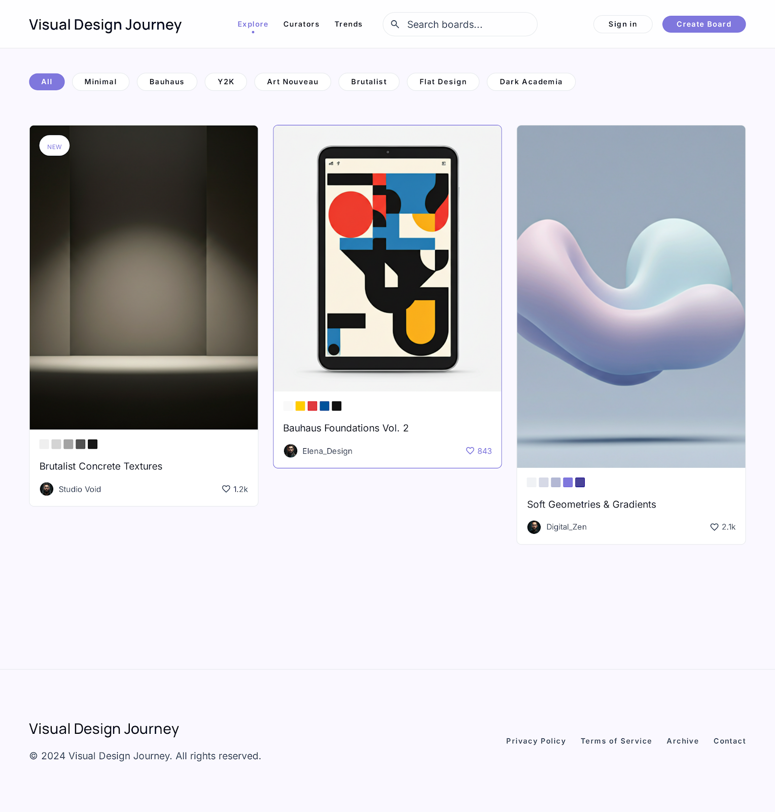
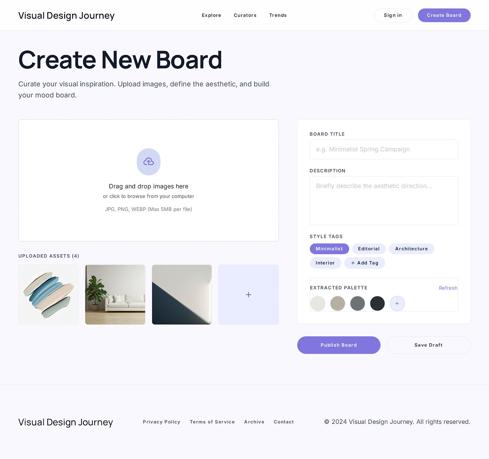
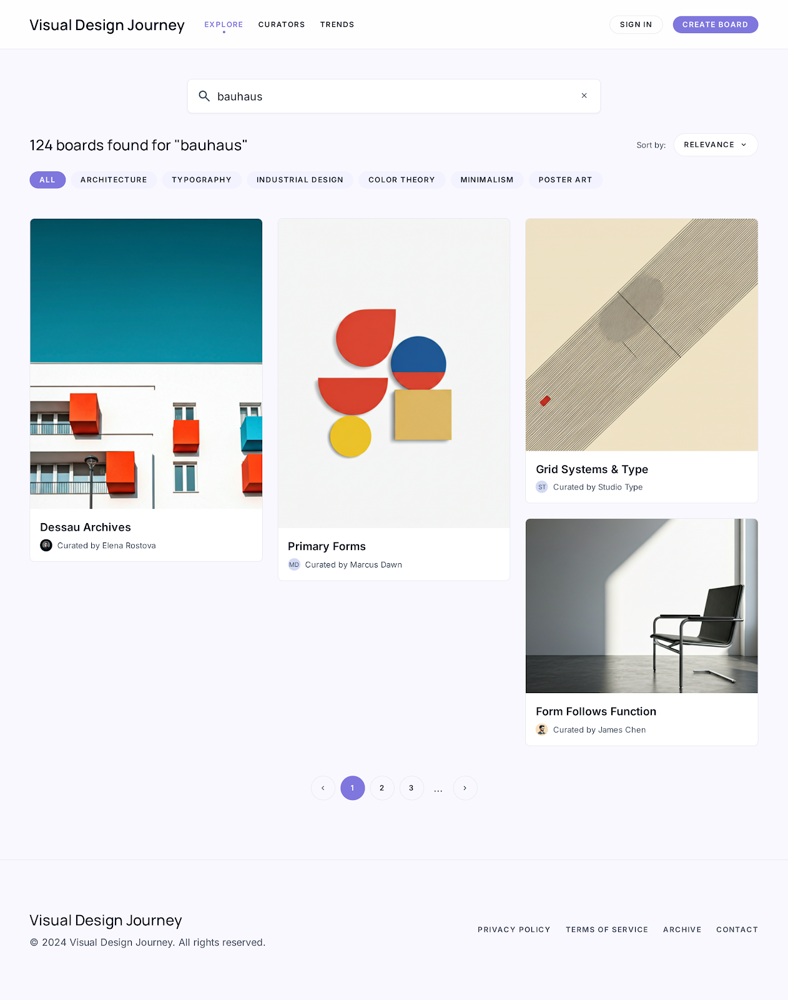
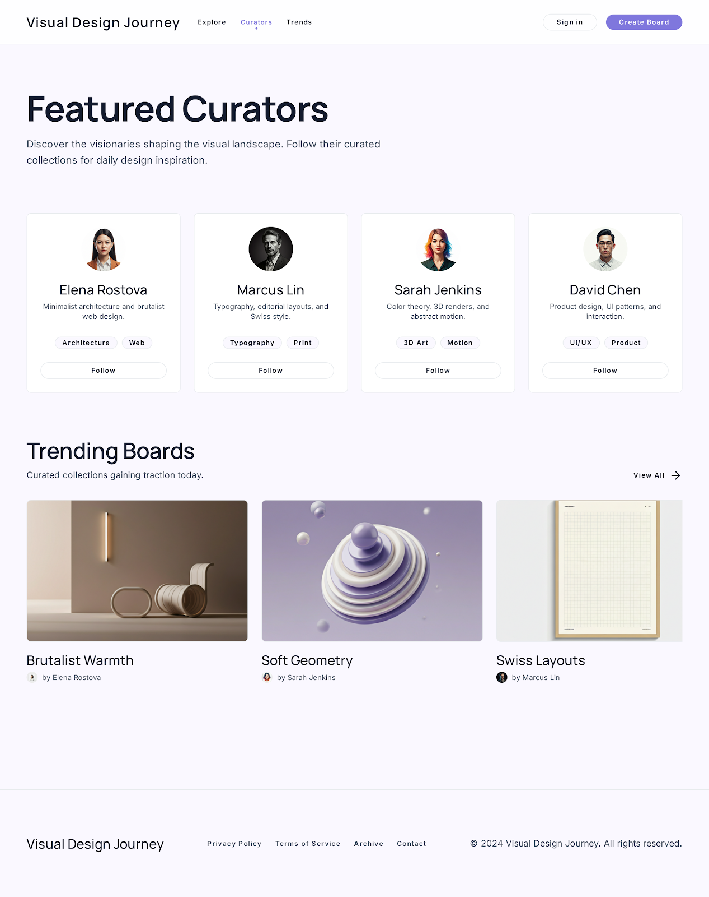
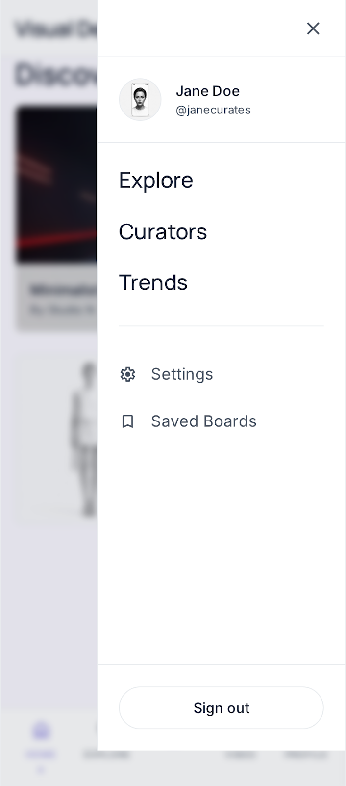

# VisualDesignJourney.com

VisualDesignJourney.com is a design discovery, curation, and creator-tool platform for visual designers. It combines an editorial design resource site, community mood-board workflows, multilingual blog content, interactive design utilities, and an admin system for content, SEO, analytics, and deployment operations.

The project is currently a hybrid Laravel + legacy PHP codebase: Laravel owns the modern application surface and Filament admin resources, while the legacy PHP implementation is preserved in `legacy-php/` for reference, rollback, and incremental migration.

## Highlights

- Editorial public site for visual design inspiration, trends, tools, and guides.
- Blog, boards, profiles, saved items, notifications, newsletter preferences, and search flows.
- Interactive tools for color, typography, gradients, shadows, contrast, responsive previews, OG images, and more.
- Filament admin resources for managing design data, blog entities, users, boards, subscribers, feeds, sponsors, and structured-data health.
- Legacy admin deploy surface with ZIP deploy, rollback, backup downloads, live verification, inbound GitHub webhook handling, and outbound deploy webhook sync.
- SEO-focused routing with sitemap, RSS feed, JSON-LD validation, localized blog routes, and public static pages.

## Screenshots

<table>
  <tr>
    <td width="50%">
      <strong>Main Feed</strong><br>
      
    </td>
    <td width="50%">
      <strong>Create Board</strong><br>
      
    </td>
  </tr>
  <tr>
    <td width="50%">
      <strong>Search Results</strong><br>
      
    </td>
    <td width="50%">
      <strong>User Profile</strong><br>
      
    </td>
  </tr>
  <tr>
    <td width="50%">
      <strong>Curators</strong><br>
      
    </td>
    <td width="50%">
      <strong>Mobile Navigation</strong><br>
      
    </td>
  </tr>
</table>

## Tech Stack

- **Backend:** PHP 8.3, Laravel 13, Filament 5
- **Frontend build:** Vite 8, Tailwind CSS 4
- **Admin:** Filament plus legacy PHP admin utilities
- **Database:** MySQL in production, SQLite for local starter/testing flows
- **Deployment:** cPanel/FTP ZIP deploy, optional Git checkout deploy, outbound webhook trigger/status sync
- **Testing:** PHPUnit via `php artisan test`

## Repository Map

```text
app/                 Laravel controllers, models, Filament resources, support classes
admin/               Legacy admin utilities, including deploy and webhook controls
api/                 Legacy PHP API endpoints still used by parts of the site
assets/              Legacy CSS/JS assets
config/              Laravel config files, safe to commit when environment-driven
database/            Migrations, seeders, factories, local DB placeholder
includes/            Legacy PHP shared helpers and deploy sync helper
legacy-php/          Preserved legacy implementation for reference and rollback
public/              Laravel public entrypoint and built public assets
resources/           Laravel Blade views, CSS, JS
routes/              Laravel routes
screens/             Design references and generated screen artifacts
storage/             Runtime folders; only `.gitignore` placeholders are tracked
tests/               Feature and unit tests
uploads/             Public upload guard; user media is not committed
```

## Local Setup

```bash
cp .env.example .env
composer install
php artisan key:generate
npm install
npm run build
php artisan migrate
php artisan test
```

For a one-command starter flow, the Composer script is also available:

```bash
composer run setup
```

## Development

Run the Laravel/Vite development stack:

```bash
composer run dev
```

Useful checks:

```bash
php artisan test
php artisan route:list
php artisan vdj:validate-json-ld
npm run build
```

The JSON-LD validator may skip database-backed blog samples when the local SQLite database has not been populated yet.

## Deployment

See [DEPLOY.md](DEPLOY.md) for the full cPanel/FTP production checklist.

The safe production flow is:

1. Back up files, uploads, and the production database.
2. Build locally with Composer and Node.
3. Upload the Laravel package without overwriting host-only credentials.
4. Configure `.env` on the server.
5. Run migrations and seeders that are safe for production.
6. Clear and rebuild Laravel caches.
7. Validate must-pass URLs, sitemap, feed, admin, and structured data.

## Admin Deploy And Webhooks

The legacy deploy page at `admin/deploy.php` provides:

- ZIP upload deploy for shared hosting installs.
- Rollback snapshot support.
- Light/full/SQL backup downloads.
- Live HTML/CSS deploy verification.
- Inbound GitHub webhook support for real Git checkouts.
- Outbound deploy webhook settings, trigger actions, status pull, retry, and deployment history.

Important distinction:

- **Inbound GitHub webhook:** GitHub calls this server after a push. It can run `git pull` only when the live folder is an actual Git checkout.
- **Outbound deploy webhook:** The admin panel calls a deploy/build hook from a host, CI, or deploy service. This is the right path for ZIP-based hosting workflows.

Webhook URLs and secrets must stay server-side. Do not hardcode private webhook URLs or tokens into frontend JavaScript.

## Security Notes

Do not commit production secrets or runtime data. The repository intentionally ignores:

- `.env` and environment-specific files
- `config/db.php`, `config/db.local.php`, `config/adsense.local.php`
- deploy tokens and deploy logs
- `vendor/` and `node_modules/`
- local SQLite databases
- runtime logs/cache/views
- generated deploy ZIP archives
- uploaded user media

Before pushing, a quick sanity check is useful:

```bash
git status --ignored -s
git diff --cached --name-only
```

## GitHub Push

GitHub no longer accepts account passwords for Git over HTTPS. When `git push` asks for a password, paste a Personal Access Token with write access to this repository.

Recommended token permissions:

- Fine-grained token
- Repository: `Ataboi/VisualDesignJourney.com`
- Permission: `Contents: Read and write`

Then push:

```bash
git push -u origin main
```

## License

This repository is maintained for VisualDesignJourney.com. Confirm licensing and asset rights before redistributing generated screens, copied references, or production content.
